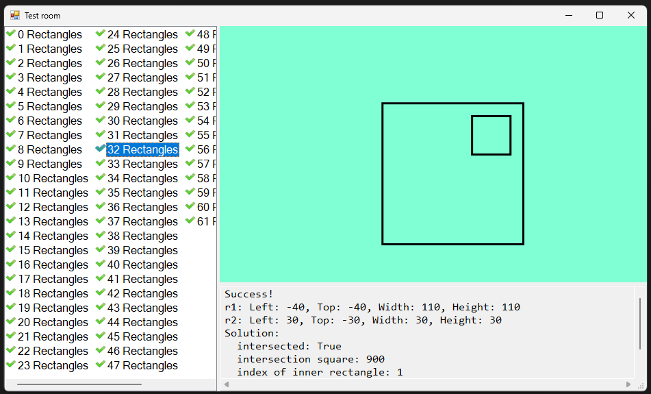

# Платформа: ulearn
## Курс: Основы программирования
### Тема: 2 Ветвления
#### Практика «Два прямоугольника»
##### Решено 24 сентября 2022 в 15:48

Даны два прямоугольника на плоскости, со сторонами параллельными осям координат с целочисленными координатами.

В классе RectanglesTask.cs реализовано три метода для работы с прямоугольниками:
- определение, есть ли у двух прямоугольников хотя бы одна общая точка (и граница и внутренность считаются частью прямоугольника);
- вычисление площади пересечения;
- определение, вложен ли один в другой.

Задание решено без использования библиотечных методов, кроме Min и Max.

Решение корректно работает с вырожденными прямоугольниками: у которых длина или ширина равны 0.

Заметка: В мире компьютерной графики принято, что верхний левый угол экрана имеет координаты (0, 0), а ось Y направлена вниз, а не вверх, как принято в математике. Поэтому в этой задаче нижний край прямоугольника имеет большую координату, чем верхний. 

